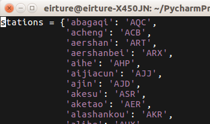
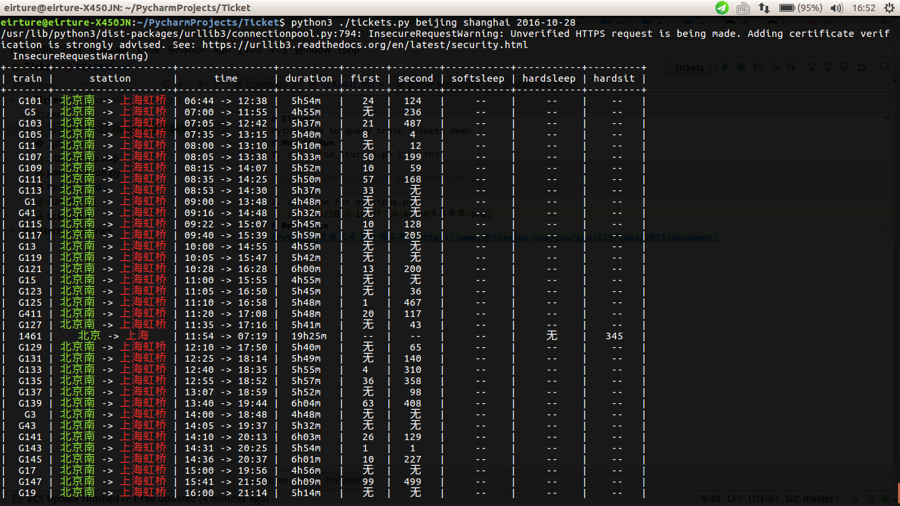

# Ticket
Python use to query train tickets demo
# How it Run
1. run parse_station.py like this
```
$ python3 parse_station.py > stations.py
```
2. add dict name to stations.py
   
3. run like this
```
# tickets.py <from_station> <to_station> <time>

$ python ./tickets.py beijing shanghai 2016-10-28
```
    
   
# Reference
[Python3 实现火车票查询工具](https://www.shiyanlou.com/courses/623/labs/2072/document)
